# GOVERNMENT HACKATHON HANDS ON LAB DAY 1

Thank you for attending day one of the Government Hackathon. Today, we will be guiding you though snowflake which will help you get 'armed' for day 2. At the end of the day you will experience the following

- Creating a streamlit app based on shared data
- Analysing data in a Snowflake Notebook using both SQL and Python
- Ingesting a publically available dataset
- Creating a share using Provider Studio
- using data from a share and combining with your own data

These are the the key aspects in order to ensure you will make the most of the hackathon during Day 2


## Set up a free trial account in AWS London

- Navigate to the following website and start a free trial of snowflake

    https://www.snowflake.com/en/

    

- When you get to the cloud options, select **Enterprise**, **AWS** and **London**.  Using the same region and cloud will make the sharing sections of the data quicker.


    

- Select Enterprise, AWS and London
- Wait for an email and then use the link to log in.


## Log into Snowflake

Welcome to Snowflake.  Before we can continue with the lab, we will be sharing you a private data share.  in order to do this, we will need the account identifier of you newly created account.

- Copy your account identifier.   You will be able to access this by clicking on your name at the bottom left hand of the screen 

    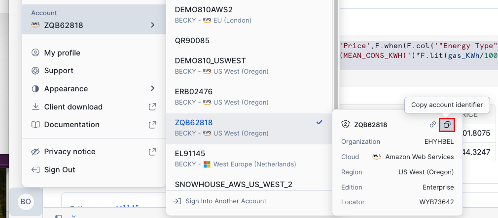


- Open up the following google form and supply your account identifier with your full name and organisation

    https://forms.gle/JXF4zSKZP6X26Unr6


I will share all the datasets during your overview session.
Enjoy your overview session

## 1 Create a Streamlit app

### 1.1 Setup

Today we will go though a working example of how data sharing can allow you to make better decisions.  We will be going through how to create a policy simulator in order to estimate the impact of changing the cold weather payment policy.  The application in its entirety could have been fully packaged as a **native app**.  However, for this example, you will be manually loading the components just incase you would like to reuse any of the source code on day 2.


-  Go to the Private Share area to access the private datasets that you will need.  The private share should now be available, if not - let us know!

    Once you press **Get** to get the data, you will see a new database appear in your trial account.  It should look like this:

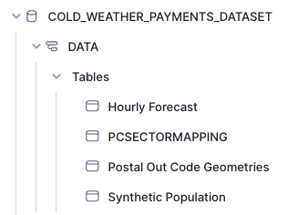

-   Open up a new worksheet and run the following SQL code.

```sql

--------initial setup for simulator -------------


CREATE OR REPLACE DATABASE POLICY_CHANGE_SIMULATOR_STREAMLIT;

CREATE OR REPLACE WAREHOUSE POLICY_CHANGE_SIMULATOR_WH WITH WAREHOUSE_SIZE='SMALL';

CREATE OR REPLACE SCHEMA DATA;

CREATE OR REPLACE SCHEMA NOTEBOOKS;

CREATE OR REPLACE SCHEMA STREAMLITS;

create or replace stage streamlit_stage DIRECTORY = (ENABLE = TRUE);


create or replace stage streamlit_stage DIRECTORY = (ENABLE = TRUE);

CREATE or replace STREAMLIT "Policy Change Simulator"
ROOT_LOCATION = '@policy_change_simulator_streamlit.streamlits.streamlit_stage'
MAIN_FILE = '/Home.py'
QUERY_WAREHOUSE = POLICY_CHANGE_SIMULATOR_WH;

```

Today we will manually add the files needed to run the app using the snowflake UI.  however, in practices it is much easier to leverage **Visual Studio Code** as demonstrated today.  You may wish to leverage Visual Studio Code in the second part of the hackathon.

- Once you have run the code, new objects would have been created

- Open up the **POLICY_CHANGE_SIMULATOR_STREAMLIT** database and navigate to the streamlit stage

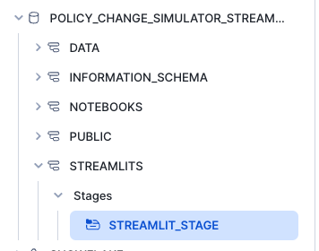

- Download following file and import it to the the stage

    [home.py](Home.py)

    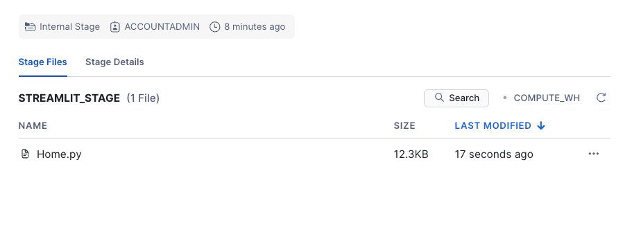

Download the following pages and add to a new directory called pages

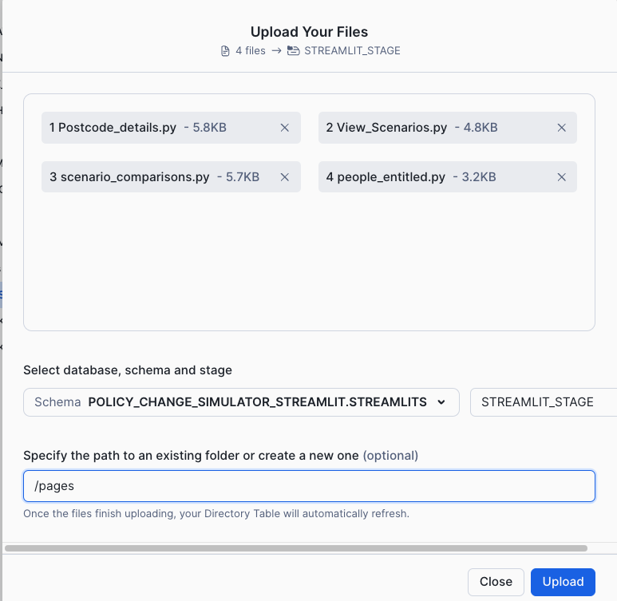


[pages](https://github.com/sfc-gh-boconnor/government_hackathon/tree/main/pages)

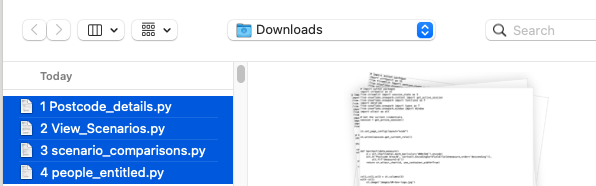


-   Download the following images and add to a new directory called images

    [Images](https://github.com/sfc-gh-boconnor/government_hackathon/tree/main/images)

    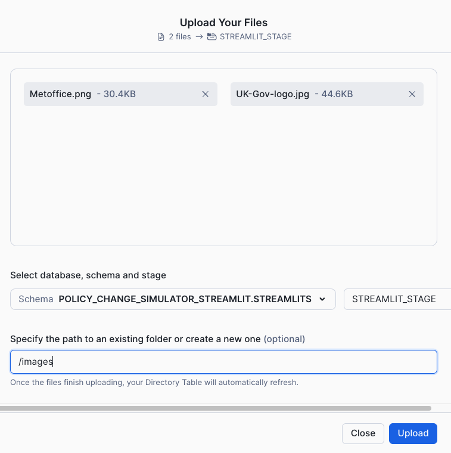

-   Download the following file and add it to the home directory

    [enviroment.yml](https://github.com/sfc-gh-boconnor/government_hackathon/tree/main/environment.yml)

    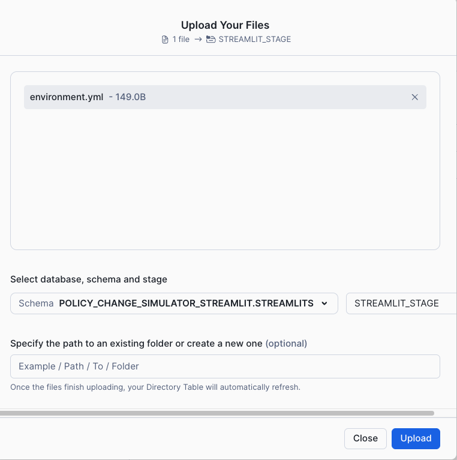

- In the Projects area, click on Streamlit

- You should ses a new streamlit app appear called **Policy Change Simulator**

    

-   Click on the **new app** and wait for it to start.


### 1.2 Create a Policy Change Scenario using the new app
-   Leave the settings 'as-is' in the sidebar, and give the scenario a name

-   Press Save Scenario for more details

    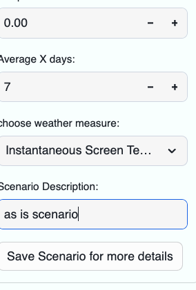

You will see summary metrics based on live calculation - all by using shared datasets.

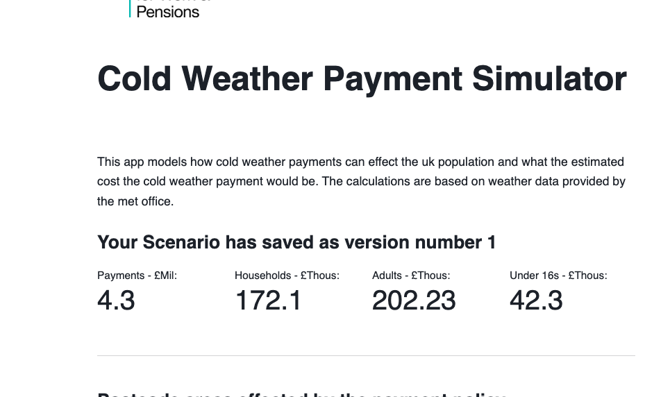

>**FACT**  You can create a packaged app which have all the dependent SQL, python packages, images and streamlits which are called 'Native apps'.  This makes a fully functioning app easy to distribute.

Spend a few minutes trying out different scenarios before we start doing our own ad-hoc analysis using a Snowflake Notebook.

## 2 Data Analysis with a Notebook

We will use the built in notebooks to do some analysis on the synthetic data.  Before this, go to the market place and search for More Metrics.  We will add Residential postcodes as an additional dataset.  Do not change the name of the database.

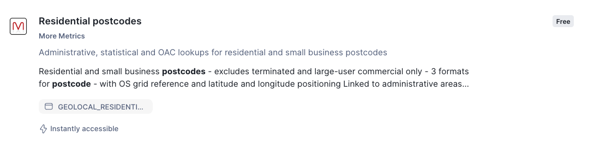

### 2.1 Viewing the data with a notebook

- Create a **New** Notebook 

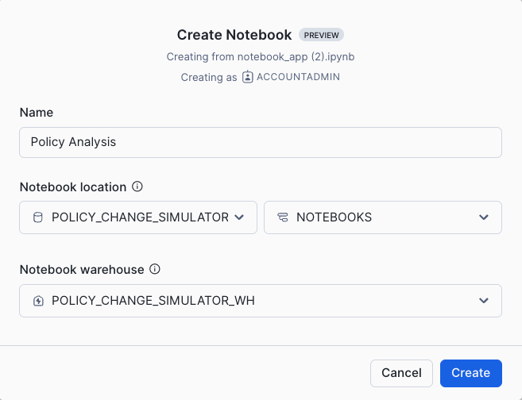

The notebook compute comes pre installed with some basic packages which include snowpark and streamlit.  In this scenario we would also like to leverage matplotlib.  As this package is freely available within the Snowflake Anoconda channel, you can install it easily using the packages dropdown packages, add matplotlib

-   Use the dropdown list provided within packages to install matplotlib.
    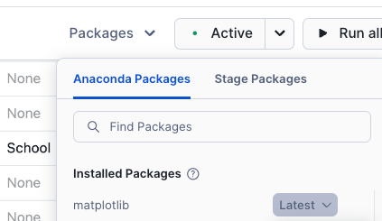

The notebook comes pre-configured with 3 sample cells - please remove all 3 cells and add 1 new cell.  

-   Copy and paste the following content to import the libraries that we will be using.


```python

#  Copyright (c) 2023 Snowflake Computing Inc. All rights reserved.

# Import python packages
import streamlit as st
import pandas as pd
from snowflake.snowpark import functions as F   
from snowflake.snowpark.window import Window
# We can also use Snowpark for our analyses!
from snowflake.snowpark.context import get_active_session
session = get_active_session()
from snowflake.snowpark import types as T


```

### 2.2 THE WHO


Our first part of the analysis is to look at the **WHO**.  The provided shared dataset contains a synthetic population dataset.  We will have a look at the contents of this.

-   Copy and paste the following python code into a new **python** cell:

```python
population = session.table('COLD_WEATHER_PAYMENTS_DATASET.DATA."Synthetic Population"')

col1,col2,col3,col4= st.columns(4)

with col1:
    st.metric('Total Population: ', population.count())
with col2:
    st.metric('Total Households:', population.select('HOUSEHOLD').distinct().count())
with col3:
    st.metric('Total Not Working', population.filter(F.col('OCCUPATION_CODE')==2).count())
with col4:
    st.metric('Total Under 16yr olds', population.filter(F.col('OCCUPATION_CODE')!=1).count())
```

You can also view the same information using SQL.

- Copy and past the following into a new **SQL** cell:

```sql

SELECT COUNT(*) "Total People", APPROX_COUNT_DISTINCT(HOUSEHOLD) "Total Households", COUNT(CASE OCCUPATION_CODE WHEN 2 THEN 1 END) "Total Not Working" FROM COLD_WEATHER_PAYMENTS_DATASET.DATA."Synthetic Population"
```

Now lets look at a sample of the population.  We will look at a sample of 20% of the population and then limit the return to 100 rows

- copy and paste the following into a new **python** cell

```python

population.sample(0.2).limit(100);

```

Lets see counts of the population py occupations and gender
- copy and paste the following into a new **python** cell

```python

gender = population.group_by('SEX').count()
occupation = population.group_by('OCCUPATION').agg(F.any_value('OCCUPATION_CODE').alias('Occupation Code')
                                                   ,F.count('*').alias('COUNT'))

st.table(gender)
st.table(occupation)

```

We will utilise streamlit's basic charting capabilities to simply look at the distribution by occupation and gender
- copy and paste the following into a new **python** cell

```python

st.markdown('People by Occupation and Sex')
col1, col2 = st.columns(2)
with col1:
    st.bar_chart(occupation,x='OCCUPATION',y='COUNT')
with col2:
    st.bar_chart(gender,x='SEX',y='COUNT')

```

We can use this information to filter the citizens
- copy and paste the following into a new **python** cell

```python

col1,col2,col3 = st.columns(3)
with col1:
    Gender = st.radio('Gender',gender)
with col2:
    elderly = st.selectbox('Occupation',occupation)
with col3:
    Age_Range = st.slider('Age Range',1,99,(1,99))

```

Add a SQL sell which will reveal a sample of the sample population.  The parameters you have just created will be used to filter the query below.

- copy and paste the following into a new **SQL** cell

```sql

select * from (select * from COLD_WEATHER_PAYMENTS_DATASET.DATA."Synthetic Population"  where SEX = '{{Gender}}' and AGE BETWEEN {{Age_Range[0]}}AND {{Age_Range[1]}} )sample(100 rows)

```

For the calculator, I have decided that all policies will be based around citizens who are **not working**, and live in households where everyone else is **not working**.

lets start of by creating a dataset based on people who are not working
- copy and paste the following into a new **python** cell

```python

population_not_working = population.filter(F.col('OCCUPATION_CODE')==2)

population_not_working.limit(10)

```

We will now create a table which counts the number of people working in every household.

- copy and paste the following into a new **python** cell

```python

population_working = population.filter((F.col('OCCUPATION_CODE')!=2) | (F.col('OCCUPATION_CODE')==1))

working_household = population_working.select('HOUSEHOLD','NI NUMBER').group_by(F.col('HOUSEHOLD')).agg(F.count('*').alias('WORKING_PEOPLE'))

working_household.limit(10)

```

Let's now visualise the people who are not working and also do not live with anyone who is working.  To do this we did a join to the the working household dataframe we just created and then filtered out any matches.  We are also importing matplotlib to visualise the distribution of key metrics.

- copy and paste the following into a new **python** cell

```python

import matplotlib.pyplot as plt

population_entitled_cold_weather = population_not_working.join(working_household, on=(population_not_working['HOUSEHOLD']==working_household['HOUSEHOLD']), how='outer',rsuffix='_L').drop('HOUSEHOLD_L')\
.filter(F.col('WORKING_PEOPLE').isNull()).drop('WORKING_PEOPLE')

st.metric('Total entitled for cold weather payments:', population_entitled_cold_weather.count())

st.markdown('#### Sample of data extracted')
hist_sample = population_entitled_cold_weather.sample(0.2)#.limit(1000)
hist = hist_sample.select(F.col('AGE'),'MORBILITIES','YEARS_AT_ADDRESS','DISTANCE_FROM_PRACTICE').to_pandas().hist(bins=7)

col1,col2,col3 = st.columns([0.2,0.6,0.2])
with col2:
    plt.show()

```
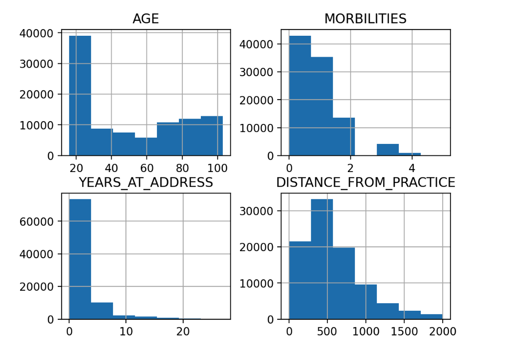


Now, let's create a table with names and addresses of all households who will get a cold weather payment if the weather permits this.

- copy and paste the following into a new **python** cell

```python

households_cold_weather = population_entitled_cold_weather.with_column('ELECTRICITY_BILL_PAYER',F.concat('FIRST_NAME',F.lit(' '),'LAST_NAME')).group_by('HOUSEHOLD','ADDRESS_1','ADDRESS_2','ADDRESS_3','POSTCODE','LSOA_CODE')\
.agg(F.any_value('ELECTRICITY_BILL_PAYER').alias('HOUSEHOLD_BILL_PAYER'),F.count('*').alias('NUMBER OF OCCUPANTS'))

households_cold_weather.sample(0.2).limit(10)

```

We have now managed to work out who would be entitled based on who is not working, and who doesn't live with anyone who is working.  Of course, in reality the selection would be more scientific - such as measuring based on who is receiving universal credits.

### 2.3 THE WHERE


In order to understand the where, we need to look at the location of the residents.  We have postcodes but we do not currently know whereabouts in the world they are linked to.  The **More Metrics** dataset has a free listing of all UK postcodes.

- Create a new **python** cell to retrieve the postcodes from **more metrics** dataset.  Use the code below

```python

postcodes = session.table('RESIDENTIAL_POSTCODES.GEOLOCAL.GEOLOCAL_RESIDENTIAL_POSTCODE')
postcodes = postcodes.select('"PCD"',F.col('LAT').astype(T.FloatType()).alias('LAT'),F.col('LON').astype(T.FloatType()).alias('LON'))
postcodes.limit(10)

```

Lets now join these postcodes to the households who may be entitled to cold weather payments

- Create a new **python** cell and copy and paste the code below

```python

households_cold_weather_with_points = postcodes.join(households_cold_weather,type='inner',
                     on=postcodes['"Postcode"']==households_cold_weather['POSTCODE'])

```


We will now leverage the streamlit module st.map to visualise where the residents are located

- Create a new **python** cell and copy and paste the code below

```python
sample = households_cold_weather_with_points.sample(0.01)

st.map(sample)
st.dataframe(sample)
```

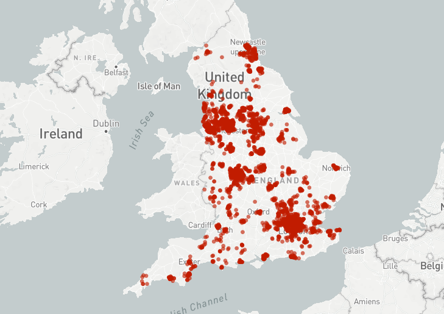


### 2.4 THE WHEN


We want the policy to pay a cold weather payment only when the weather has reached a certain level.  At this point in time, its based on postcode, and its based on if the weather gets colder than 0 degrees in any 7 day rolling period.  For this calculation, we need historical weather data.  This is what we will use the met office weather data for.

- copy and paste the following into a new **python** cell:

```python

summary_data = session.table('COLD_WEATHER_PAYMENTS_DATASET.DATA."Hourly Forecast"')
summary_data.show()

```

Creating the calculation will require time series analysis. Lets construct a date from the 'Valid Hour' column  and filter the dates to be when the policy is valid


```python

hourly_with_date = summary_data.with_column('"Date"',
                         F.date_from_parts(F.substr('"Valid Hour"',1,4),
                                          F.substr('"Valid Hour"',5,2),
                                          F.substr('"Valid Hour"',7,2)))

hourly_with_date_grp = hourly_with_date.filter(F.col('"Date"').between('2022-11-01','2023-03-31'))\
.group_by('"Date"').agg(F.avg(F.cast('"Instantaneous Screen Temperature"',T.FloatType())).alias('Instantaneous Screen Temperature'))

```

- Create a new **python** cell to view the weather data over time as a line chart.  We are looking at Screen Temperature.

```python

st.line_chart(hourly_with_date_grp,y='Instantaneous Screen Temperature',x='Date')

```

We will then group the average temperature by the weather station and date - we want to see average temperature per day rather than hourly

- copy and paste the following into a new **python** cell:
```python

hourly_with_date = hourly_with_date.groupBy(F.col('"SSPA Identifier"'),
                         F.col('"Date"')).agg(F.avg('"Instantaneous Screen Temperature"').alias('AVERAGE_TEMP'))

hourly_with_date.limit(10)

```
You will note that the **where** is in fact  a site identifier.  We want to change this so we have postcode sector instead.  A mapping table is used to map the site with postcode

- copy and paste the following into a new **python** cell:

```python

weather_station = session.table('COLD_WEATHER_PAYMENTS_DATASET.DATA.PCSECTORMAPPING')\
.select('"SiteID"','PC_SECT','LONG','LAT')\
.with_column('Postcode_Area',F.call_function('SPLIT_PART',F.col('PC_SECT'),'_',1)).distinct()
weather_station.limit(100).to_pandas()

```

Now we have our mapping, we need to summarize the weather by postcode area (the policy goes by postcode area - i.e (DY13)).   

- copy and paste the following into a new **python** cell:

```python

hourly_with_date_ws = hourly_with_date.join(weather_station,on=weather_station['"SiteID"']==hourly_with_date['"SSPA Identifier"'])\
.group_by('"Date"',
          'POSTCODE_AREA').agg(F.avg(F.cast('LAT',T.FloatType())).alias('LAT'),
                               F.avg(F.cast('LONG',T.FloatType())).alias('LON'),
                               F.avg(F.cast('AVERAGE_TEMP',T.FloatType())).alias('AVERAGE_TEMP'))

hourly_with_date_ws.limit(10)

```

Because we need the calculation to be based on a moving average, we need the next calculation to be **dynamic**.  Snowflake supports **window** functions - which allows the calculation to be applied after the result set is generated. 

>[more info on window calculations](https://docs.snowflake.com/en/sql-reference/functions-analytic)


Lets create a python function to calculate the moving average


- copy and paste the following into a new **python** cell:
```python

def movaverage(days,df):
    window = Window.partition_by(F.col('"POSTCODE_AREA"')).orderBy(F.col('"Date"').desc()).rows_between(Window.currentRow,7)

    # Add moving averages columns for Cloud Cover and Solar Energy based on the previously defined window
    df = df.with_column('"Temp_Max_Temp_7_Days"',F.max(F.cast("AVERAGE_TEMP",T.FloatType())).over(window)).sort('"Date"')
    
    # Change the data type to a float
    df = df.with_column('"AVERAGE_TEMP"',F.cast('"AVERAGE_TEMP"',T.FloatType()))
    
    return df

```

Let's now apply the moving average function in order to filter our weather to only provide postcodes where the temperature has ben 0 or below for 7 or more consecutive days

- copy and paste the following into a new **python** cell:

```python

mov_average = movaverage(7,hourly_with_date_ws).filter(F.col('"Temp_Max_Temp_7_Days"')<=0)
mov_average

```

We will now join this filtered weather data set to the effected households that would be entitled to a cold weather payment.

- copy and paste the following into a new **python** cell:
```python

people_affected = mov_average.join(households_cold_weather_with_points.drop('LAT','LON'),
                 on= mov_average['POSTCODE_AREA'] == F.call_function('SPLIT_PART', households_cold_weather_with_points['"PCD"'],F.lit(' '),1))

people_affected

```


Finally lets view this on a map
- copy and paste the following into a new **python** cell:


```python

st.map(people_affected)

```

So in summary we have looked at some techniques to understand the who, the when and the where.

## 3 Private Listings

In this section we will be looking at ingesting data, sharing the data, using a share and finally analysing data from both local and shared data.

### 3.1 Ingesting data
You saw before how to create a streamlit app - and then leveraged the notebook to analyse the data.

What if we want more data?  There are lots of ways to ingest data.  For this section we will do a simple approach.  There is a dataset which features pre pay meter data.

Click on the links below to see an example data set you could use to complement the existing datasets.

https://www.gov.uk/government/statistics/postcode-level-electricity-statistics-2022

https://www.gov.uk/government/statistics/postcode-level-gas-statistics-2022

#### Nominate a Partner

You will both be a provider and a consumer of data.

- Agree with the partner on who will be supplying gas statistics and who will be supplying electric statistics. 

>The Gas provider needs to download [**this**](https://assets.publishing.service.gov.uk/media/65b10088160765001118f7bd/Postcode_level_gas_2022.csv)

>The Electric provider needs to download [**this**](https://assets.publishing.service.gov.uk/media/65b0d1c2f2718c0014fb1be5/Postcode_level_all_meters_electricity_2022.csv)


- Once you have downloaded your designated CSV file, switch back to your existing snowflake notebook and within the data pane, click on the 3 dots on the side of the **DATA** schema to Load data

    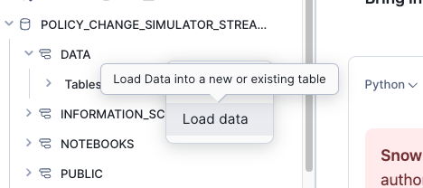

-   Press Browse and find the file you have downloaded on your laptop

    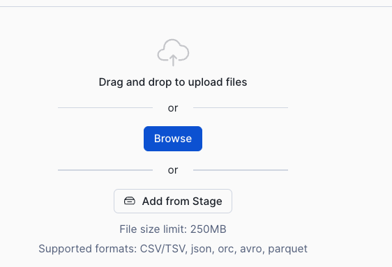


    

-   Call the table Energy_usage_postcode then press Next. 


-   Check the column names are as expected then press Load

    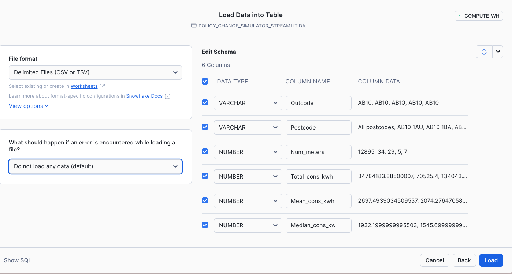

After about 5 seconds you should get something like this:

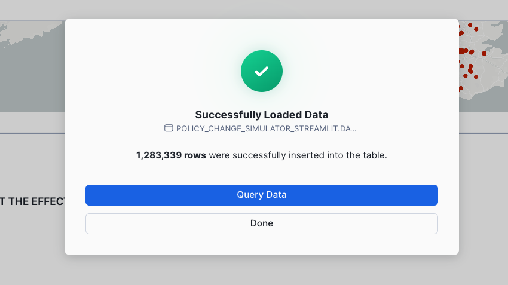

-   Press **Done**


-   Add a new **python** cell in the notebook


```python

meter_data = session.table('POLICY_CHANGE_SIMULATOR_STREAMLIT.DATA.ENERGY_USAGE_POSTCODE')
meter_data.limit(10)

```

You will see that there is a column that says 'All postcodes - this dataset has summary data for each postcode area.  This is useful as the cold weather payment is worked out by postcode area.

- Add a new **python** cell to only retrieve data for each postcode area.

```python

meter_data_pcd_area = meter_data.filter(F.col('POSTCODE')=='All postcodes').drop('POSTCODE')
meter_data_pcd_area

```


- Create another **python** cell which shows the detail version.

```python
meter_data_pcd = meter_data.filter(F.col('POSTCODE')!='All postcodes')
meter_data_pcd.sample(0.05)

```

### 3.1 Prepare Secure Views of data for Sharing
Now as a data provider, I would like to share this data in this format to other organisations.  For this we need to create secure views of the data (or tables/dynamic tables)

- Add a new **python** cell to convert these dataframes to views. **IMPORTANT** replace the word Electric with **Gas** on both view names if you have ingested **gas** data.

```python

meter_data_pcd.create_or_replace_view('DATA."Electric Meter by Postcode"')
meter_data_pcd_area.create_or_replace_view('DATA."Electric Meter by Postcode Area"')


```

Once created you will see 2 views appear in the data schema

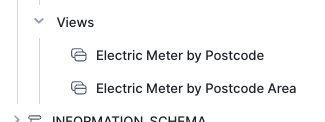

As we are sharing the data, we need to make these views secure.  
- Create a **SQL** cell and copy and paste the following into it.  Again, if you are a provider of **gas** data, change the word Electric to **Gas**.

```sql

ALTER VIEW DATA."Electric Meter by Postcode" SET SECURE;
ALTER VIEW DATA."Electric Meter by Postcode Area" SET SECURE;


```


### 3.2 Create a Private Listing

We will now create a private listing using provider studio.


- Go to the home page, then navigate to Data Products, then **Provider Studio**


- Click on the New Listing button

    

- Call the listing Energy Usage and make sure **Only Specified Customers** is selected

    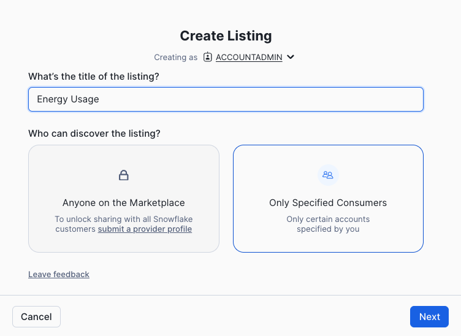

- Press **Next**

- In the Whats in the listing button, navigate to the 2 new secure views.

    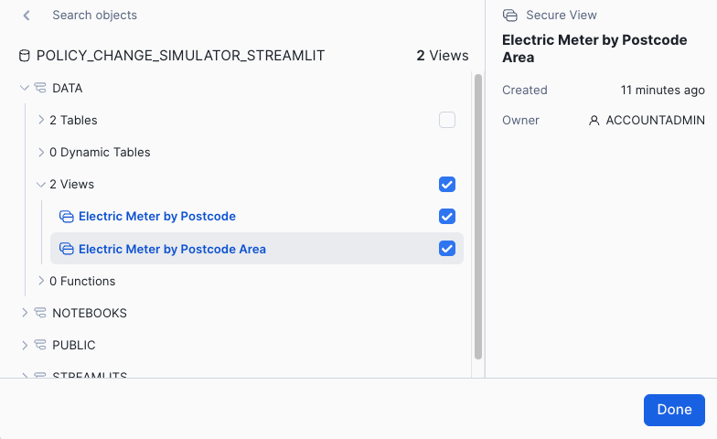

-   Select them with the tick boxes then press **Done**

-   Rename the secure share identifier to ENERGY_USAGE_ELECTRIC

- Under Add consumer accounts area, choose your partners account to share with by typing the identifier into the **add consumer account** box. 

> **HINT**  You and your partner can access the identifier details in the same way as you did this morning (when you provided the identifier so we could share the initial dataset with you)

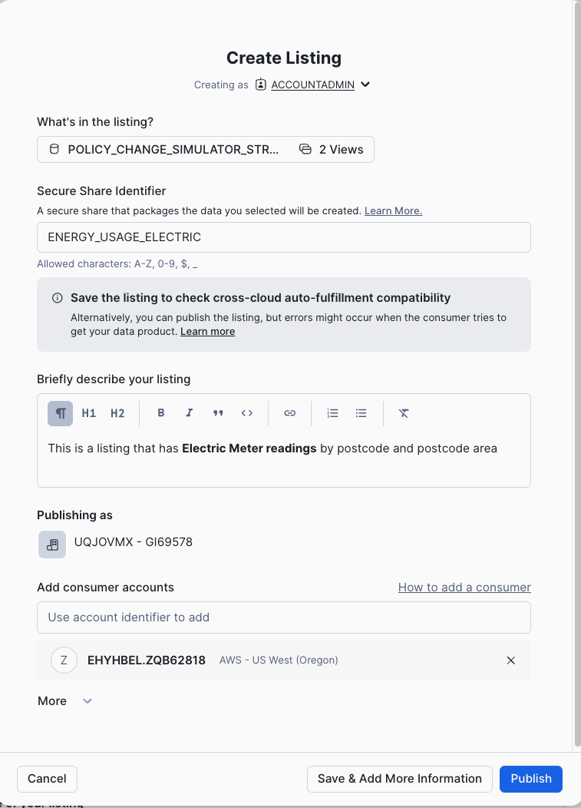


- Press **Publish**


    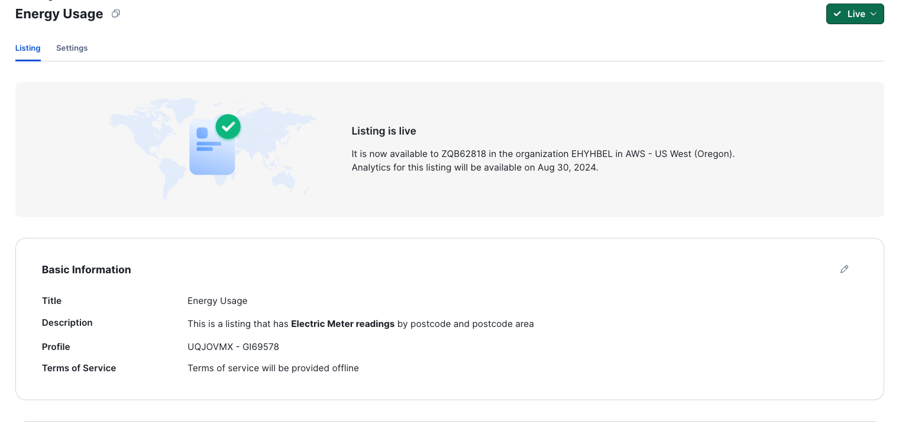


Check that the other person can get the data.

They need to go to **Private Sharing** and the new dataset should appear.


Download the data as before.  If your trial account is in the same region/cloud the data will be instant.  If its in a different region, it will take 10 minutes.


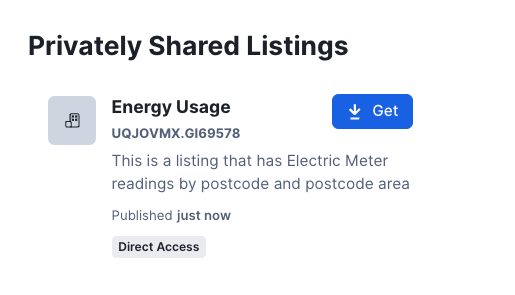


### 3.3 Analysing both local and shared data from a private listing

So you should now have access to both **gas** and **electricity** data.  One local and one from a share.

If you haven't already done so, get the other energy listing data from the private shares.  

> **HINT** You have already done this step before with the initial data share. The new Data share will be in the Private Sharing area.

- Go back to the original notebook and this time add a **SQL** cell.


```sql

CREATE OR REPLACE VIEW "Energy by Postcode Area"

as
SELECT *, 'ELECTRIC' as "Energy Type" FROM ENERGY_USAGE.DATA."Electric Meter by Postcode Area"

UNION 

SELECT *, 'GAS' as "Energy Type" FROM DATA."Gas Meter by Postcode Area"

```
You have just created a simple view which combines the two datasets together.

- Add a **python** cell to load the data from the view into a dataframe

```python

total_energy_area = session.table('"Energy by Postcode Area"')

total_energy_area;

```

- Create a **basic** dataframe in a new **python** cell which views both datasets

```python


total_energy = total_energy_area.group_by('"Energy Type"').agg(F.sum('NUM_METERS'),
                                          F.mean('MEAN_CONS_KWH'),
                                          F.median('MEDIAN_CONS_KWH'))

total_energy


```

We will now add some **variables** to change the price cap as well as the current prices of gas and electric

- Copy and paste the following code in a new **python** cell

```python

electric_KWh = st.number_input('Electric KWh in pence',1.00,30.00,22.36)
gas_KWh = st.number_input('Gas KWh in pence',1.00,7.00,5.48)
price_cap = st.number_input('Price Cap',1,6000,2000)

```


Next apply the price variables for gas and electric to the data

- Copy and paste the following code in a new **python** cell
```python

total_energy_avg_price = total_energy.with_column('Price',F.when(F.col('"Energy Type"')=='GAS',
                                        F.col('AVG(MEAN_CONS_KWH)')*F.lit(gas_KWh/100)).else_(F.col('AVG(MEAN_CONS_KWH)')*F.lit(electric_KWh/100)))

total_energy_avg_price

```


Next add the % change of prices based on the price cap variable

- Copy and paste the following code in a new **python** cell
```python

price_cap_change = total_energy_avg_price.agg(F.sum('PRICE')).with_column('cap_price',
                                                                          F.lit(price_cap)).with_column('% change',
                                                                                                        F.div0('SUM(PRICE)',
                                                                                                               'CAP_PRICE'))

price_cap_change

```


Finally apply the % change to all postcode areas
- Copy and paste the following code in a new **python** cell

```python

total_energy_area_changes = total_energy_area.with_column('Price',F.when(F.col('"Energy Type"')=='GAS',
                                        F.col('MEAN_CONS_KWH')*F.lit(gas_KWh/100)).else_(F.col('MEAN_CONS_KWH')*F.lit(electric_KWh/100)))

total_energy_area_changes = total_energy_area_changes.\
join(price_cap_change.select('"% change"')).with_column('"New Price"',
                                                    F.col('PRICE')+ F.col('PRICE')*F.col('"% change"'))

total_energy_area_changes

```


**Well done**, you have created a share to enrich your own data in order to find out what the average yearly cost of fuel will be across all postcode areas.

## HOMEWORK

Between now and the next session, please decide which dataset you would like to work with.  You will be using the time to analyse your data and then, you will be sharing this dataset in provider studio.  