#### GOVERNMENT HACKATHON HANDS ON LAB

##### Set up a free trial account in AWS London

##### Log into Snowflake


Copy your account identifier.  This lab you will be leveraging a private share which I will be supplying

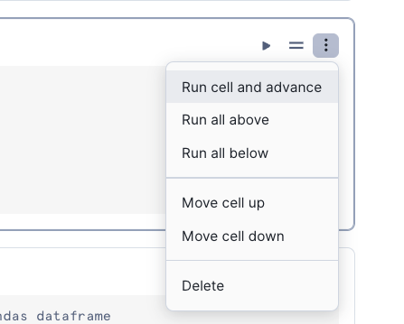

Open up the following google form and supply your account identifier with your full name and organisation

https://forms.gle/JXF4zSKZP6X26Unr6


I will share all the datasets during your overview session.

> Enjoy your overview session

### HANDS ON LAB

Today we will go though a working example of how data sharing can allow you to make better decisions.  We will be going through how to create a policy simulator in order to estimate the impact of changing the cold weather payment policy.

##### Go to the Private Share area to access the private datasets that you will need.  The private share should now be available, if not - let us know!

Once you press **Get** to get the data, you will see a new database appear in your trial account.  It should look like this:

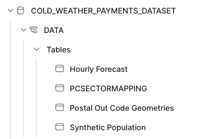


#### Creating the Streamlit app.


Run the SQL Script [run sql setup](sql_setup.sql)

Today we will manually add the files needed to run the app using the snowflake UI.  however, in practices it is much easier to leverage Visual Studio Code as demonstrated today.  You may wish to leverage VSCode in the second part of the hackathon.

You can import this SQL script and run all within Snow sight.


- Open up the **POLICY_CHANGE_SIMULATOR_STREAMLIT** database and navigate to the streamlit stage

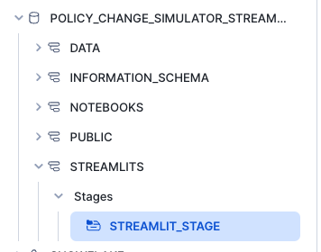

- Download following file and import it to the the stage

[home.py](Home.py)

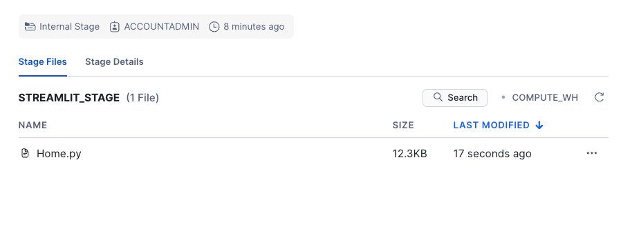

Download the following pages and add to a new directory called pages

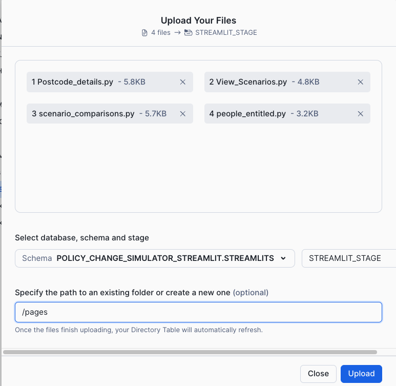


[pages](https://github.com/sfc-gh-boconnor/government_hackathon/tree/main/pages)

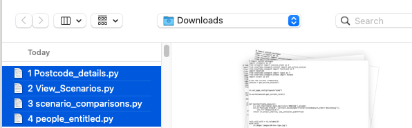


Download the following images and add to a new directory called images

[Images](https://github.com/sfc-gh-boconnor/government_hackathon/tree/main/images)

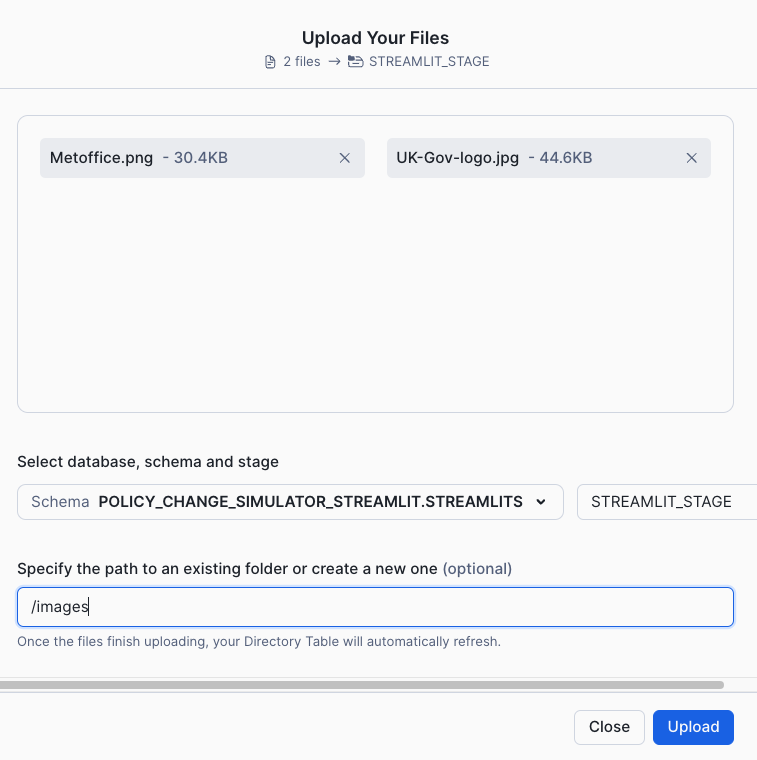

Download the following file and add it to the home directory

[enviroment.yml](https://github.com/sfc-gh-boconnor/government_hackathon/tree/main/environment.yml)

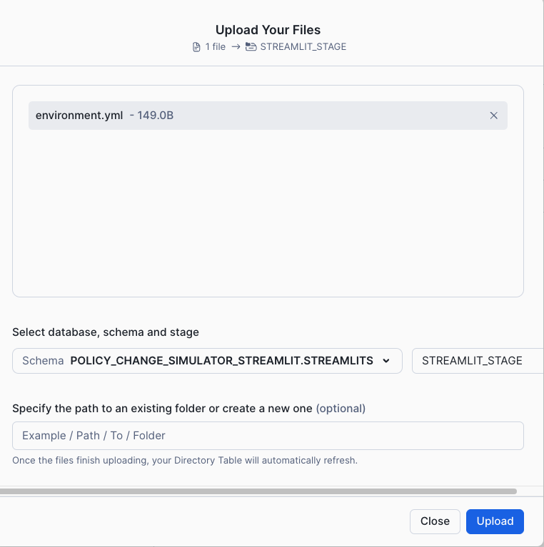

- In the Projects area, click on Streamlit

- You should ses a new streamlit app appear called **Policy Change Simulator**


Click on the **new app** and wait for it to start.


##### Create a Scenario
Leave the settings 'as-is' in the sidebar, and give the scenario a name

Press Save Scenario for more details

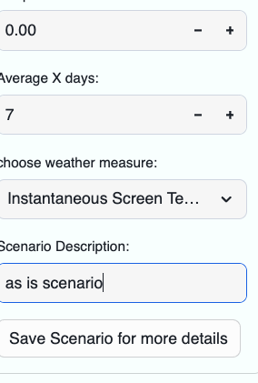

You will see summary metrics based on live calculation - all by using shared datasets.

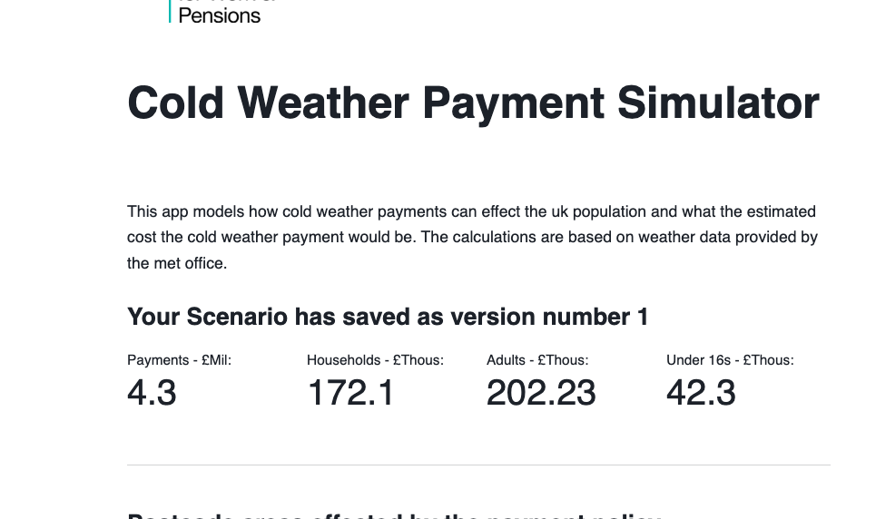

>**FACT**  You can create a packaged app which have all the dependent SQL, python packages, images and steamlits which are called 'Native apps'.  This makes a fully functioning app easy to distribute.


#### Data Analysis

We will use the built in notebooks to do some analysis on the synthetic data.  Before this, go to the market place and search for More Metrics.  We will add Residential postcodes as an additional dataset.  Do not change the name of the database.

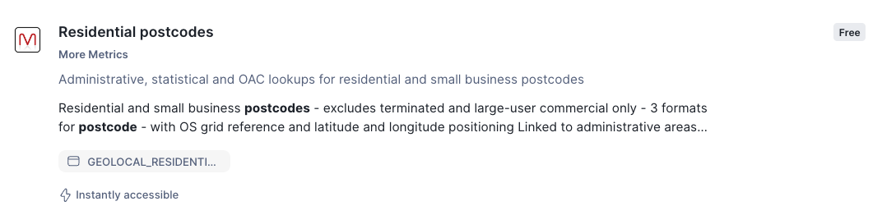

#### Viewing the data with a notebook

Create a New Notebook 

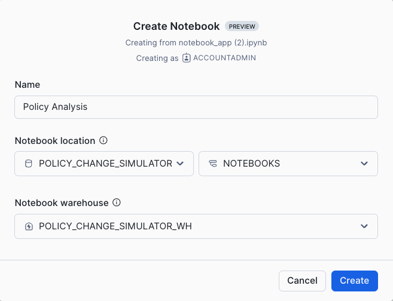

Under packages, add matplotlib

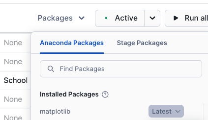

Import the following libraries:

```python

#  Copyright (c) 2023 Snowflake Computing Inc. All rights reserved.

# Import python packages
import streamlit as st
import pandas as pd
from snowflake.snowpark import functions as F   
from snowflake.snowpark.window import Window
# We can also use Snowpark for our analyses!
from snowflake.snowpark.context import get_active_session
session = get_active_session()
from snowflake.snowpark import types as T


```
Our first part of the analysis is to look at the 'WHO'.  The provided shared dataset contains a synthetic population dataset.  We will have a look at the contents of this.

Copy and paste the following python code into a new cell:

```python
population = session.table('COLD_WEATHER_PAYMENTS_DATASET.DATA."Synthetic Population"')

col1,col2,col3,col4= st.columns(4)

with col1:
    st.metric('Total Population: ', population.count())
with col2:
    st.metric('Total Households:', population.select('HOUSEHOLD').distinct().count())
with col3:
    st.metric('Total Not Working', population.filter(F.col('OCCUPATION_CODE')==2).count())
with col4:
    st.metric('Total Under 16yr olds', population.filter(F.col('OCCUPATION_CODE')!=1).count())
```

You can also view the same information using SQL.

Copy and past the following into a new **SQL** cell:

```sql

SELECT COUNT(*) "Total People", APPROX_COUNT_DISTINCT(HOUSEHOLD) "Total Households", COUNT(CASE OCCUPATION_CODE WHEN 2 THEN 1 END) "Total Not Working" FROM COLD_WEATHER_PAYMENTS_DATASET.DATA."Synthetic Population"
```

Now lets look at a sample of the population.  We will look at a sample of 20% of the population and then limit the return to 100 rows

```python

population.sample(0.2).limit(100);

```

Lets see counts of the population py occupations and gender

```python

gender = population.group_by('SEX').count()
occupation = population.group_by('OCCUPATION').agg(F.any_value('OCCUPATION_CODE').alias('Occupation Code')
                                                   ,F.count('*').alias('COUNT'))

st.table(gender)
st.table(occupation)

```

We will utilise streamlit's basic charting capabilities to simply look at the distribution by occupation and gender

```python

st.markdown('People by Occupation and Sex')
col1, col2 = st.columns(2)
with col1:
    st.bar_chart(occupation,x='OCCUPATION',y='COUNT')
with col2:
    st.bar_chart(gender,x='SEX',y='COUNT')

```

We can use this information to filter the citizens

```python

col1,col2,col3 = st.columns(3)
with col1:
    Gender = st.radio('Gender',gender)
with col2:
    elderly = st.selectbox('Occupation',occupation)
with col3:
    Age_Range = st.slider('Age Range',1,99,(1,99))

```

Add a SQL sell which will reveal a sample of the sample population

```sql

select * from (select * from COLD_WEATHER_PAYMENTS_DATASET.DATA."Synthetic Population"  where SEX = '{{Gender}}' and AGE BETWEEN {{Age_Range[0]}}AND {{Age_Range[1]}} )sample(100 rows)

```

For the calculator, I have decided that all policies will be based around citizens who are not working, and live in households where everyone else is not working.

lets start of by creating a dataset based on people who are not working

```python

population_not_working = population.filter(F.col('OCCUPATION_CODE')==2)

population_not_working.limit(10)

```

We will now create a table which counts the number of people working in every household.

```python

population_working = population.filter((F.col('OCCUPATION_CODE')!=2) | (F.col('OCCUPATION_CODE')==1))

working_household = population_working.select('HOUSEHOLD','NI NUMBER').group_by(F.col('HOUSEHOLD')).agg(F.count('*').alias('WORKING_PEOPLE'))

working_household.limit(10)

```

Let's now visualise the people who are not working and also do not live with anyone who is working.  To do this we did a join to the the working household datafreame we just created and then filtered out any matches.  We are also importing matplotlib to visualise the distribution of key metrics.

```python

import matplotlib.pyplot as plt

population_entitled_cold_weather = population_not_working.join(working_household, on=(population_not_working['HOUSEHOLD']==working_household['HOUSEHOLD']), how='outer',rsuffix='_L').drop('HOUSEHOLD_L')\
.filter(F.col('WORKING_PEOPLE').isNull()).drop('WORKING_PEOPLE')

st.metric('Total entitled for cold weather payments:', population_entitled_cold_weather.count())

st.markdown('#### Sample of data extracted')
hist_sample = population_entitled_cold_weather.sample(0.2)#.limit(1000)
hist = hist_sample.select(F.col('AGE'),'MORBILITIES','YEARS_AT_ADDRESS','DISTANCE_FROM_PRACTICE').to_pandas().hist(bins=7)

col1,col2,col3 = st.columns([0.2,0.6,0.2])
with col2:
    plt.show()

```
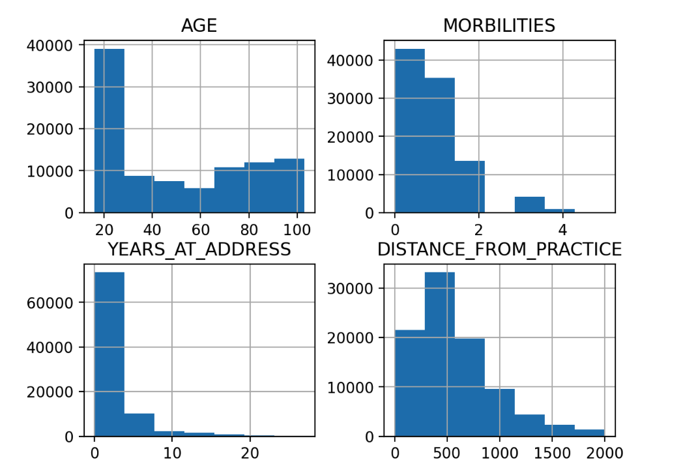


Now, let's create a table with names and addresses of all households who will get a cold weather payment if the weather permits this.

```python

households_cold_weather = population_entitled_cold_weather.with_column('ELECTRICITY_BILL_PAYER',F.concat('FIRST_NAME',F.lit(' '),'LAST_NAME')).group_by('HOUSEHOLD','ADDRESS_1','ADDRESS_2','ADDRESS_3','POSTCODE','LSOA_CODE')\
.agg(F.any_value('ELECTRICITY_BILL_PAYER').alias('HOUSEHOLD_BILL_PAYER'),F.count('*').alias('NUMBER OF OCCUPANTS'))

households_cold_weather.sample(0.2).limit(10)

```

We have now managed to work out who would be entitled based on who is not working, and who doesnt live with anyone who is working.  Of course, in reality the selection would be more scientific - such as measuring based on who is receiving universal credits.

#### Understanding the Where

In order to understand the where, we need to look at the location of the residents.  We have postcodes but we do not currently know where abouts in the world they are linked to.  The 'More Metrics' dataset has a free listing of all UK postcodes.

Create a new python cel to retrieve the postcodes from more metrics

```python

postcodes = session.table('RESIDENTIAL_POSTCODES.GEOLOCAL.GEOLOCAL_RESIDENTIAL_POSTCODE')
postcodes = postcodes.select('"PCD"',F.col('LAT').astype(T.FloatType()).alias('LAT'),F.col('LON').astype(T.FloatType()).alias('LON'))
postcodes.limit(10)

```

Lets now join these postcodes to the households who may be entitled to cold weather payments

```python

households_cold_weather_with_points = postcodes.join(households_cold_weather,type='inner',
                     on=postcodes['"Postcode"']==households_cold_weather['POSTCODE'])

```


We will now leverge the streamlit module st.map to visualise where the residents are located

```python
sample = households_cold_weather_with_points.sample(0.01)

st.map(sample)
st.dataframe(sample)
```

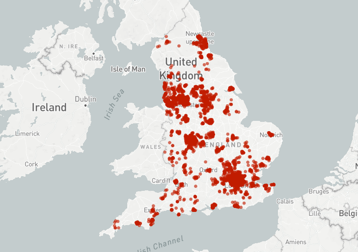


#### LETS LOOK AT THE WHEN


We want the policy to pay a cold weather payment only when the weather has reached a certain level.  At this point in time, its based on postcode, and its based on if the weather gets colder than 0 degrees in any 7 day rolling period.  For this calculation, we need historical weather data.  This is what we will use the met office weather data for.

copy and past the following into a new python cell:

```python

summary_data = session.table('COLD_WEATHER_PAYMENTS_DATASET.DATA."Hourly Forecast"')
summary_data.show()

```

Creating the calculation will require time series analysis. Lets construct a date from the 'Valid Hour' column  and filter the dates to be when the policy is valid


```python

hourly_with_date = summary_data.with_column('"Date"',
                         F.date_from_parts(F.substr('"Valid Hour"',1,4),
                                          F.substr('"Valid Hour"',5,2),
                                          F.substr('"Valid Hour"',7,2)))

hourly_with_date_grp = hourly_with_date.filter(F.col('"Date"').between('2022-11-01','2023-03-31'))\
.group_by('"Date"').agg(F.avg(F.cast('"Instantaneous Screen Temperature"',T.FloatType())).alias('Instantaneous Screen Temperature'))

```

Create a new python cel to view the weather data over time as a line chart.  We are looking at Screen Temperature.

```python

st.line_chart(hourly_with_date_grp,y='Instantaneous Screen Temperature',x='Date')

```

We will then group the average temperature by the weather station and date - we want to see average temperature per day rather than hourly

```python

hourly_with_date = hourly_with_date.groupBy(F.col('"SSPA Identifier"'),
                         F.col('"Date"')).agg(F.avg('"Instantaneous Screen Temperature"').alias('AVERAGE_TEMP'))

hourly_with_date.limit(10)

```
You will note that the 'where is infact  a site identifier.  We want to change this so we have postcode sector instead.  A mapping table is used to map the site with postcode

```python

weather_station = session.table('COLD_WEATHER_PAYMENTS_DATASET.DATA.PCSECTORMAPPING')\
.select('"SiteID"','PC_SECT','LONG','LAT')\
.with_column('Postcode_Area',F.call_function('SPLIT_PART',F.col('PC_SECT'),'_',1)).distinct()
weather_station.limit(100).to_pandas()

```

Now we have our mapping, we need to summarise the weather by postcode area (the policy goes by postcode area - i.e (DY13)).   

```python

hourly_with_date_ws = hourly_with_date.join(weather_station,on=weather_station['"SiteID"']==hourly_with_date['"SSPA Identifier"'])\
.group_by('"Date"',
          'POSTCODE_AREA').agg(F.avg(F.cast('LAT',T.FloatType())).alias('LAT'),
                               F.avg(F.cast('LONG',T.FloatType())).alias('LON'),
                               F.avg(F.cast('AVERAGE_TEMP',T.FloatType())).alias('AVERAGE_TEMP'))

hourly_with_date_ws.limit(10)

```

Because we need the calculation to be based on a moving average, we need the next calculation to be dynamic.  Snowflake supports window calculations - which allows the calculation to be applied after the result set is generated.

Lets create a python function to calculate the moving average


```python

def movaverage(days,df):
    window = Window.partition_by(F.col('"POSTCODE_AREA"')).orderBy(F.col('"Date"').desc()).rows_between(Window.currentRow,7)

    # Add moving averages columns for Cloud Cover and Solar Energy based on the previously defined window
    df = df.with_column('"Temp_Max_Temp_7_Days"',F.max(F.cast("AVERAGE_TEMP",T.FloatType())).over(window)).sort('"Date"')
    
    


    # Change the data type to a float
    df = df.with_column('"AVERAGE_TEMP"',F.cast('"AVERAGE_TEMP"',T.FloatType()))
    
    return df

```

Let's now apply the moving average function in order to filter our weather to only provide postcodes where the temperature has ben 0 or below for 7 or more consecutive days


```python

mov_average = movaverage(7,hourly_with_date_ws).filter(F.col('"Temp_Max_Temp_7_Days"')<=0)
mov_average

```

We will now join this filtered weather data set to the effected households that would be entitled to a cold weather payment

```python

people_affected = mov_average.join(households_cold_weather_with_points.drop('LAT','LON'),
                 on= mov_average['POSTCODE_AREA'] == F.call_function('SPLIT_PART', households_cold_weather_with_points['"PCD"'],F.lit(' '),1))

people_affected

```


Finally lets view this on a map


```python

st.map(people_affected)

```


#### Creating Your own private listing


You saw before how to create a streamlit app - and then leveraged the notebook to analyse the data.

What if we want more data?  There are lots of ways to ingest data.  For this section we will do a simple approach.  There is a dataset which features pre pay meter data.


Click on the links below to see an example data set you could use to complement the existing datasets.

https://www.gov.uk/government/statistics/postcode-level-electricity-statistics-2022

https://www.gov.uk/government/statistics/postcode-level-gas-statistics-2022

Download one of the files.  In my case, I will download the Postcode level gas statistics.

Once you have downloaded a CSV file, switch back to the snowflake notebook and within the data pane, click on the 3 dots on the side of the 'DATA' schema to Load data

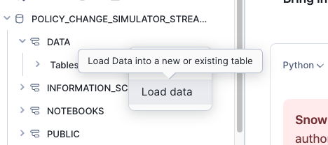

Press Browse and find the file you have downloaded on your laptop

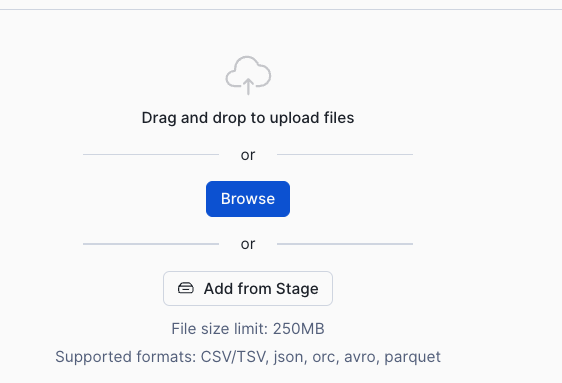


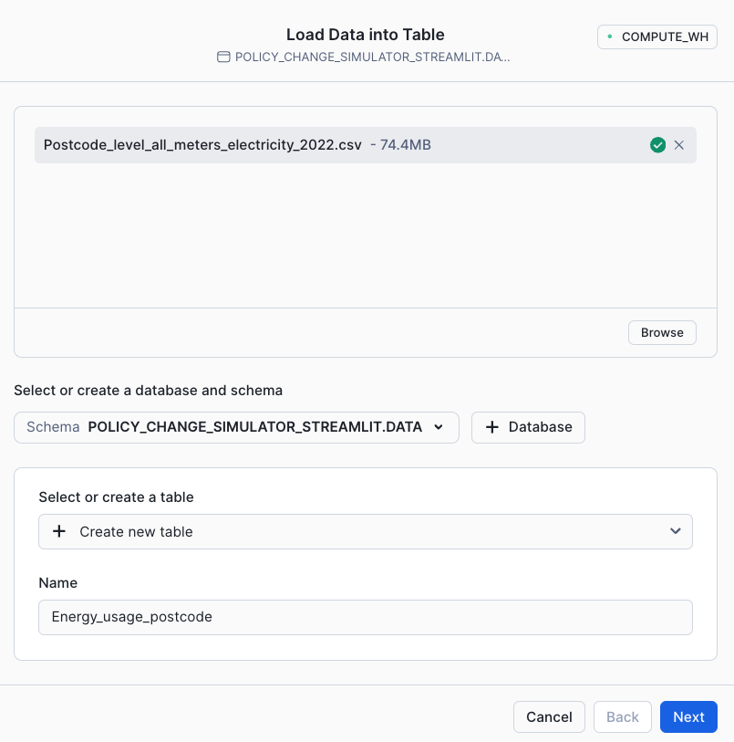

Call the table Energy_usage_postcode then press Next. 


Check the column names are as expected then press Load

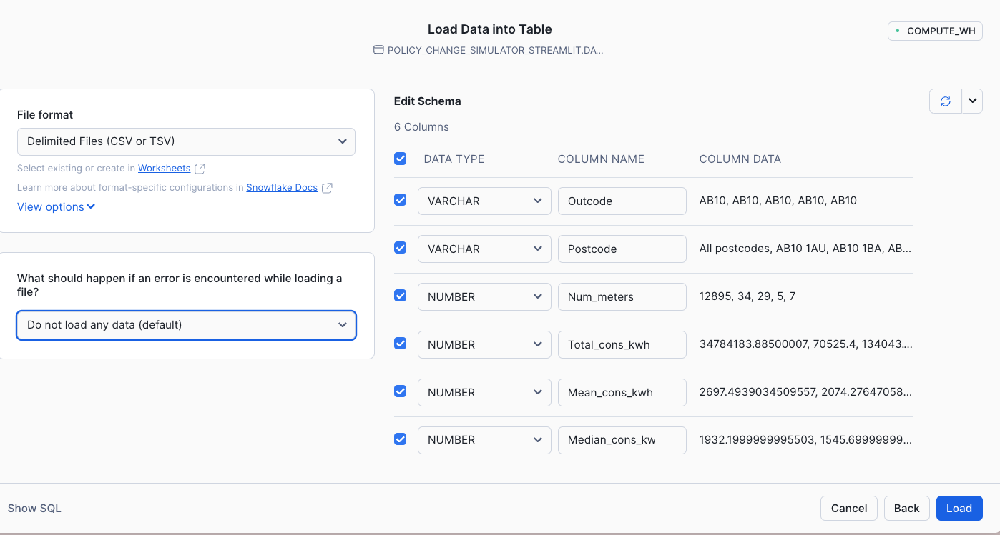

After about 5 seconds you should get something like this:


Press Done


Add a new cell in the notebook


```python

meter_data = session.table('POLICY_CHANGE_SIMULATOR_STREAMLIT.DATA.ENERGY_USAGE_POSTCODE')
meter_data.limit(10)

```

You will see that there is a column that says 'All postcodes - this dataset has summary data for each postcode area.  This is useful as the cold weather payment is worked out by postcode area.

Add a new python cell to only retrieve data for each postcode area.

```python

meter_data = meter_data.filter(F.col('POSTCODE')=='All postcodes').drop('POSTCODE')
meter_data

```


Create another cell which shows the detail version.

```python

meter_data_pcd = meter_data.filter(F.col('POSTCODE')!='All postcodes')
meter_data_pcd.sample(0.05)

```


Now as a data provider, I would like to share this data in this format to other organisations.  For this we need to create secure views of the data (or tables/dynamic tables)

Add a new cell to convert these dataframes to views

```python

meter_data_pcd.create_or_replace_view('"Electric Meter by Postcode"')
meter_data_pcd_area.create_or_replace_view('"Electric Meter by Postcode"')


```

Once created you will see 2 views appear in the data schema


As we are sharing the data, w need to make these views secure.  Create a SQL cell and copy and paste the following into it

```sql

ALTER VIEW DATA."Electric Meter by Postcode" SET SECURE;
ALTER VIEW DATA."Electric Meter by Postcode Area" SET SECURE;


```


#### CREATE A PRIVATE LISTING

