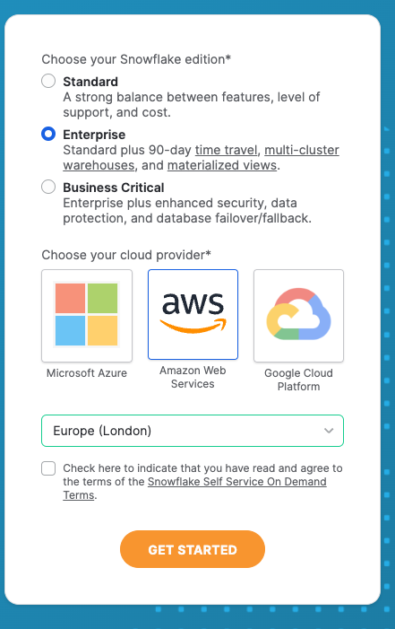
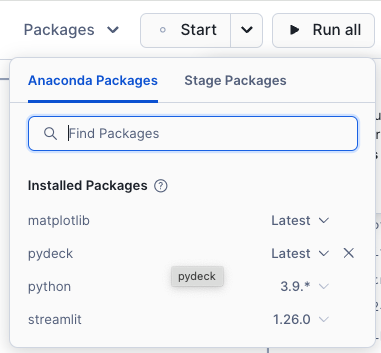
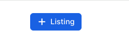

# GOVERNMENT HACKATHON HANDS ON LAB DAY 1

Thank you for attending day one of the Government Hackathon. Today, we will be guiding you though snowflake which will help you get 'armed' for day 2. At the end of the day you will experience the following

- Creating a streamlit app based on shared data
- Analysing data in a Snowflake Notebook using both SQL and Python
- Ingesting a publically available dataset
- Creating a share using Provider Studio
- using data from a share and combining with your own data

These are the the key aspects in order to ensure you will make the most of the hackathon during Day 2


## Set up a free trial account in AWS London

- Navigate to the following website.   Right click on the link below to open a new tab and start a free trial of snowflake

    https://www.snowflake.com/en/ 

    

- Fill in the fields provided with your details and press Continue.

- When you get to the cloud options, select **Enterprise**, **AWS** and **Europe (London)**.  
- Check the box to agree to the Self Service On Demand Terms.
- Press **Get Started**


    


- Either Skip or answer the multiple choice questions.
- Wait for an email called **Activate your Snowflake account** 
- Within the email click the button **CLICK TO ACTIVATE**  
- Create a Username and Password then press **Get Started**.
- When you see the Welcome to Snowflake! How do you want to start? click **Skip fo now** 


## Log into Snowflake

Welcome to Snowflake.  Before we can continue with the lab, we will be sharing you a private data share.  in order to do this, we will need the account identifier of you newly created account.

- Log out of Snowflake by clicking on your name at the bottom left hand side of the screen then press **Sign Out**

- Sign back into your newly created account.  This will ensure your account details for sharing purposes are populated.

- Copy your account identifier.   You will be able to access this by clicking on your name at the bottom left hand of the screen which opens a menu.  Within the menu you will need to navigate to account, your newly created trial account which will reveal the details. Press the **copy** button as highlighted in the screenshot below to copy your account identifier to the clipboard.  

    


- Open up the following google form in a new tab and supply your account identifier with your full name and organisation

    https://forms.gle/JXF4zSKZP6X26Unr6


I will share all the datasets with your newly created trial account during your overview session.

Enjoy your overview session

<hr>


## 1 Create a Streamlit app

### 1.1 Setup

Today we will go though a working example of how data sharing can allow you to make better decisions.  We will be going through how to create a policy simulator in order to estimate the impact of changing the cold weather payment policy.  The application in its entirety could have been fully packaged as a **native app**.  However, for this example, you will be manually loading the components just incase you would like to reuse any of the source code on day 2.

- Within the navigation menu you will see a menu item called **Data Products**.  Click to expand.

- Click on **Private Sharing**.

-  You will see a private share called **Cold Weather Payments Dataset**.

- Press **Get** to get the data.  You will see a new database appear in your trial account.  If you navigate to **Data** you will see the share which will look like this:


#### Creating your own database

You will now create a database to host all the assets needed to try out the simulator.

- Click on Projects from the navigation bar.

- Click on the '+' on the top left hand side of the screen to create a new SQL worksheet

-   Copy and paste the code below into your new SQL worksheet.

```sql

--------initial setup for simulator -------------


CREATE OR REPLACE DATABASE POLICY_CHANGE_SIMULATOR_STREAMLIT;

CREATE OR REPLACE WAREHOUSE POLICY_CHANGE_SIMULATOR_WH WITH WAREHOUSE_SIZE='SMALL';

CREATE OR REPLACE SCHEMA DATA;

CREATE OR REPLACE SCHEMA NOTEBOOKS;

CREATE OR REPLACE SCHEMA STREAMLITS;

create or replace stage streamlit_stage DIRECTORY = (ENABLE = TRUE);


create or replace stage streamlit_stage DIRECTORY = (ENABLE = TRUE);

CREATE or replace STREAMLIT "Policy Change Simulator"
ROOT_LOCATION = '@policy_change_simulator_streamlit.streamlits.streamlit_stage'
MAIN_FILE = '/Home.py'
QUERY_WAREHOUSE = POLICY_CHANGE_SIMULATOR_WH;

```

- Next to the blue button on the top left hand side of the screen, you will see a drop down menu.  Click on the drop down menu and select **Run All**

- Wait for all 8 sql commands to execute.


#### Adding the Files to run the app

Today we will manually add the files needed to run the app using the snowflake UI.  however, in practice it is much easier to leverage **Visual Studio Code**  as a 'client IDE'  You may wish to leverage Visual Studio Code in the second part of the hackathon.  We will be available to help you connect snowflake to Visual Studio Code if this is something you wish to do.


- Press the 'House' to navigate to the home page
- Click on Data, then expand **POLICY_CHANGE_SIMULATOR_STREAMLIT**

- Expand **POLICY_CHANGE_SIMULATOR_STREAMLIT** and expand **STREAMLITS**
- Expand Stages and click on **STREAMLIT_STAGE**


- Press **+Files**
- Download following file and import it to the the stage

    [home.py](Home.py)

    

- Click on **+ Files** to load more files.

Download the following files 

[pages](https://github.com/sfc-gh-boconnor/government_hackathon/tree/main/pages)

- Upload the files to a new directory called pages. You can ctrl+click to select multiple files.  before pressing upload, type /pages where it says *"Specify the path to an existing folder or create a new one"*

- press upload


-   Download the following images and add to a new directory called images.  You will do this in the same way as you did for pages.  This time when you specify the folder, you will type in /images.

    [Images](https://github.com/sfc-gh-boconnor/government_hackathon/tree/main/images)

    

-   Download the following file and add it to the home directory.  This file specifies which packages are needed to run the app.  You will not need to specify a folder name in this exercise.

    [enviroment.yml](https://github.com/sfc-gh-boconnor/government_hackathon/tree/main/environment.yml)

    

#### Running the Streamlit app

- Navigate to the Projects menu
- Click on Streamlit
- Click on **Policy Change Simulator**

    

-   Click on the **new app** and wait for it to start.


### 1.2 Create a Policy Change Scenario using the new app
-   Leave the settings 'as-is' in the sidebar, and give the scenario a name

-   Press Save Scenario for more details

    

You will see summary metrics based on live calculation - all by using shared datasets.


>**FACT**  You can create a packaged app which have all the dependent SQL, python packages, images and streamlits which are called 'Native apps'.  This makes a fully functioning app easy to distribute.

Spend a few minutes trying out different scenarios before we start doing our own ad-hoc analysis using a Snowflake Notebook.

## 2 Data Analysis with a Notebook

We will use a notebook to do some analysis on the synthetic data.  Before this you will need to link to an additional data share. 

- Go back to the home page and select **Data Products**


- Residential postcodes.  

- Click on the Residential postcodes More Metrics Dataset.  This provides all the coordinates for every postcode in the UK


- Press **Get** to get the data.

- Press **Done**


### 2.1 Viewing the data with a notebook

Now you have the data and have created a streamlit app, you will take a step back and have a look at how the raw data can be analysed.

- open the following [notebook](viewing_data_in_notebook.ipynb) and download the file to your computer.

- Back in the homepage, selecct Projects and then **Notebooks**
- Create a Notebook by importing from a **.ipynb file**

    

-   Select the downloaded notebook and press **Open**.

- Choose POLICY_CHANGE_SIMULATOR under for Notebook location and NOTEBOOKS under schema

-   Choose POLICY_CHANGE_SIMULATOR_WH for warehouse and then press **create**

The notebook compute comes pre-installed with some basic packages which include snowpark and streamlit.  In this scenario we would also like to leverage **matplotlib** and **pydeck**.  As this package is freely available within the Snowflake Annoconda channel, you can install these supported packages easily.

-   Use the dropdown list provided within packages to install matplotlib and pydeck.
    

- Press **Start** to start the notebook.

Go through the steps in the notebook which you have uploaded to snowflake.  Once you have completed section 2, return to this guide.

### 2.2 Review of Section 2
So in summary we have looked at some techniques to understand the who, the when and the where.  This is all featured around the impacts of cold weather payments.  Another impact might be the cost of energy.  For this exercise you will experience data sharing between one another.
<hr>

## 3 Share data with Private Listings

In this section we will be looking at ingesting data, sharing the data, using a share and finally analysing data from both local and shared data.

### 3.1 Ingesting data
You saw before how to create a streamlit app - and then leveraged the notebook to analyse the data.

What if we want more data?  There are lots of ways to ingest data.  For this section we will do a simple approach.  There is a dataset which features pre pay meter data.

Click on the links below to see an example data set you could use to complement the existing datasets.

https://www.gov.uk/government/statistics/postcode-level-electricity-statistics-2022

https://www.gov.uk/government/statistics/postcode-level-gas-statistics-2022

#### Gas Or Electric??

Some of you will be providers of Electric, others will be providers of gas

- In the chat, we have provided you with which accounts are electric providers and which are gas. 

>The Gas provider needs to download [**this**](https://assets.publishing.service.gov.uk/media/65b10088160765001118f7bd/Postcode_level_gas_2022.csv)

- Choose Postcode level all domestic meters electricity 2022

>The Electric provider needs to download [**this**](https://assets.publishing.service.gov.uk/media/65b0d1c2f2718c0014fb1be5/Postcode_level_all_meters_electricity_2022.csv)

- Choose postcode level domestic gas 2022


- Once you have downloaded your designated CSV file, switch back to the home page in Snowflake by clicking on the house.

**Ingest the Data**

Click on **Data** and select the database **policy_change_simulator_streamlit**

Select the schema **Data** then on the top right hand corner, navigate and select **Create Table from File**

    

-   Press Browse and find the file you have downloaded on your laptop

    


    

-   Call the table Energy_usage_postcode then press Next. 


-   Check the column names are as expected then press Load

    

After about 5 seconds you should get something like this:


-   Press **Done**

**Creating a new Notebook**

- Go back to the Home page and Select Projects
- Select **Notebooks** and press + Notebook to create a new notebook
- Give the notebook the name *Energy Usage*
- For Notebook location, choose *Policy Change Simulator*
- For Schema, change it from Public to **Notebooks**
- For Notebook warehouse, select **POLICY_CHANGE_SIMULATOR_WH
- Press **Create**

#### Adding packages and import libraries

-   Same as earlier, add the **pydeck** by importing the package

- You will notice that the notebook will come pre-installed with a sample notebook.  We will not be using cell 2 and 3.

- Using the 3 dots in cell 2, click on them and press **Delete**


- Using the 3 dots in cell 3, click on them and press **Delete**

- Run cell 1

-   Add a new **python** cell in the notebook


```python

from snowflake.snowpark import functions as F
from snowflake.snowpark import types as T
meter_data = session.table('POLICY_CHANGE_SIMULATOR_STREAMLIT.DATA.ENERGY_USAGE_POSTCODE')
meter_data.limit(10)

```

You will see that there is a column that says 'All postcodes - this dataset has summary data for each postcode area.  This is useful as the cold weather payment is worked out by postcode area.

- Add a new **python** cell to only retrieve data for each postcode area.

```python

meter_data_pcd_area = meter_data.filter(F.col('POSTCODE')=='All postcodes').drop('POSTCODE')
meter_data_pcd_area

```


- Create another **python** cell which shows the detail version.

```python
meter_data_pcd = meter_data.filter(F.col('POSTCODE')!='All postcodes')
meter_data_pcd.sample(0.05)

```
<hr>

### 3.1 Prepare Secure Views of data for Sharing
Now as a data provider, I would like to share this data in this format to other organisations.  For this we need to create secure views of the data (or tables/dynamic tables)

- Add a new **python** cell to convert these dataframes to views. **IMPORTANT** replace the word Electric with **Gas** on both view names if you have ingested **gas** data.

```python

meter_data_pcd.create_or_replace_view('DATA."Electric Meter by Postcode"')
meter_data_pcd_area.create_or_replace_view('DATA."Electric Meter by Postcode Area"')


```

Once created you will see 2 views appear in the data schema. You can see this by toggling from **Files** to **Databases** within the left hand window pane.


As we are sharing the data, we need to make these views secure.  
- Create a **SQL** cell and copy and paste the following into it.  Again, if you are a provider of **gas** data, change the word Electric to **Gas**.

```sql

ALTER VIEW DATA."Electric Meter by Postcode" SET SECURE;
ALTER VIEW DATA."Electric Meter by Postcode Area" SET SECURE;


```


### 3.2 Create a Private Listing

We will now create a private listing using provider studio.


- Go to the home page,and click **Leave** to leave the notebook.

- Navigate to Data Products, then **Provider Studio**


- Click on the + Listing button

    

- Call the listing Energy Usage **ELECTRIC OR GAS** and make sure **Only Specified Customers** is selected

    

- Press **Next**

- In the Whats in the listing button, navigate to the 2 new secure views.

    

-   Select them with the tick boxes then press **Done**

-   Rename the secure share identifier to ENERGY_USAGE

- In the Briefly Describe your listing section, type in a short summary which describes your dataset.

- Under Add consumer accounts area, choose your the consumer account to share with by typing the identifier into the **add consumer account** box. 


- Press **Publish**


    


Once the assigned provider of the other energy source has shared their data, you will be able to see it in Private sharing.

 - Go to **Private Sharing** and the new dataset should appear.


Download the data as before.  


### 3.3 Analysing both local and shared data from a private listing

So you should now have access to both **gas** and **electricity** data.  One local and one from a share.

If you haven't already done so, get the other energy listing data from the private shares.  

> **HINT** You have already done this step before with the initial data share. The new Data share will be in the Private Sharing area.

- Go back to the Energy Usage notebook 

- Rerun cell 1 and two to ensure we have imported the right libraries. 

- scroll to the bottom add a **SQL** cell.


```sql

CREATE OR REPLACE VIEW "Energy by Postcode Area"

as
SELECT *, 'GAS' as "Energy Type" FROM ENERGY_USAGE__GAS.DATA."Gas Meter by Postcode Area"

UNION 

SELECT *, 'ELECTRIC' as "Energy Type" FROM DATA."Electric Meter by Postcode Area"

```

- Run the cell.

You have just created a simple view which combines the two datasets together.

>Note - The above sql will fail for the Gas provider - you will need to change the database paths.  The Electric Provider will only need supply the schema and table as the notebook is saved inside the database where the data is situated.   You can see the exact paths by selecting the Databases tab within the left hand pane.

- Add a **python** cell to load the data from the view into a dataframe

```python

total_energy_area = session.table('"Energy by Postcode Area"')

total_energy_area;

```

- Create a **basic** dataframe in a new **python** cell which views both datasets

```python


total_energy = total_energy_area.group_by('"Energy Type"').agg(F.sum('NUM_METERS'),
                                          F.mean('MEAN_CONS_KWH'),
                                          F.median('MEDIAN_CONS_KWH'))

total_energy


```

We will now add some **variables** to change the price cap as well as the current prices of gas and electric

- Copy and paste the following code in a new **python** cell

```python

electric_KWh = st.number_input('Electric KWh in pence',1.00,30.00,22.36)
gas_KWh = st.number_input('Gas KWh in pence',1.00,7.00,5.48)
price_cap = st.number_input('Price Cap',1,6000,2000)

```


Next apply the price variables for gas and electric to the data

- Copy and paste the following code in a new **python** cell
```python

total_energy_avg_price = total_energy.with_column('Price',F.when(F.col('"Energy Type"')=='GAS',
                                        F.col('AVG(MEAN_CONS_KWH)')*F.lit(gas_KWh/100)).else_(F.col('AVG(MEAN_CONS_KWH)')*F.lit(electric_KWh/100)))

total_energy_avg_price

```


Next add the % change of prices based on the price cap variable

- Copy and paste the following code in a new **python** cell
```python

price_cap_change = total_energy_avg_price.agg(F.sum('PRICE')).with_column('cap_price',
                                                                          F.lit(price_cap)).with_column('% change',
                                                                                                        F.div0('SUM(PRICE)',
                                                                                                               'CAP_PRICE'))

price_cap_change

```


Finally apply the % change to all postcode areas
- Copy and paste the following code in a new **python** cell

```python

total_energy_area_changes = total_energy_area.with_column('Price',F.when(F.col('"Energy Type"')=='GAS',
                                        F.col('MEAN_CONS_KWH')*F.lit(gas_KWh/100)).else_(F.col('MEAN_CONS_KWH')*F.lit(electric_KWh/100)))

total_energy_area_changes = total_energy_area_changes.\
join(price_cap_change.select('"% change"')).with_column('"New Price"',
                                                    F.col('PRICE')+ F.col('PRICE')*F.col('"% change"'))

total_energy_area_changes

```


### 3.4 Create a heatmap using H3 using the detailed energy information

- Create a new view using a new **SQL** cell - NB. You will need to modify the select statement for the gas providers - again, same as before, look at the databases area to find exact path name.  (this is within the share)

```SQL

CREATE OR REPLACE VIEW DATA."Energy by Postcode Detail"

as

SELECT *, 'GAS' as "Energy Type" FROM ENERGY_USAGE__GAS.DATA."Gas Meter by Postcode"

UNION 

SELECT *, 'ELECTRIC' as "Energy Type" FROM DATA."Electric Meter by Postcode"


```
- Create a new **python** cell which will forecast the average price of fuel per postcode.  We will also join to the postcode dataset provided by **more metrics**


```python

total_energy_detail = session.table('DATA."Energy by Postcode Detail"')

total_energy_detail_changes = total_energy_detail.with_column('Price',F.when(F.col('"Energy Type"')=='GAS',
                                        F.col('MEAN_CONS_KWH')*F.lit(gas_KWh/100)).else_(F.col('MEAN_CONS_KWH')*F.lit(electric_KWh/100)))

total_energy_detail_changes = total_energy_detail_changes.\
join(price_cap_change.select('"% change"')).with_column('"New Price"',
                                                    F.col('PRICE')+ F.col('PRICE')*F.col('"% change"'))

postcodes = session.table('RESIDENTIAL_POSTCODES.GEOLOCAL.GEOLOCAL_RESIDENTIAL_POSTCODE').select('PCD','LAT','LON')
fuel_cost = total_energy_detail_changes.join(postcodes,postcodes['PCD']==total_energy_detail_changes['POSTCODE'])
fuel_cost = fuel_cost.group_by('POSTCODE').agg(F.any_value('LAT').alias('LAT'),
                                              F.any_value('LON').alias('LON'),
                                              F.mean('"New Price"').alias('"New Price"'),
                                              F.mean('PRICE').alias('"Price"'))

```

Index the latitude and longitude and group by H3

Create a new python cell using the code below:

```python

H3 = fuel_cost.with_column('H3',F.call_function('H3_LATLNG_TO_CELL_STRING',F.col('LAT'),F.col('LON'),F.lit(5)))\
.group_by('H3').agg(F.mean('"Price"').alias('"Current_Price"'),
                   F.mean('"New Price"').alias('"New_Price"'))

```
Now we will leverage the previously installed **pydeck** package to render a map in H3.

Copy and paste the following python code below:

```python

import pydeck as pdk

H3pd = H3.to_pandas()

color_scheme = f"""[
    0 * (New_Price/{price_cap} < 1) + 255 * (New_Price/{price_cap} >= 1),
    114 * (New_Price/{price_cap} < 1) + 100 * (New_Price/{price_cap} >= 1),
    189 * (New_Price/{price_cap} < 1) + 0 * (New_Price/{price_cap} >= 1)
    ]"""


h3 = pdk.Layer(
        "H3HexagonLayer",
        H3pd,
        pickable=True,
        stroked=True,
        filled=True,
        extruded=False,
        get_hexagon="H3",
        get_fill_color=color_scheme,
        line_width_min_pixels=0,
        opacity=0.4)

#### render the map showing trainstations based on overture maps

tooltip = {
   "html": """<b>H3:</b> {H3} <br> <b>New Price:</b> {New_Price}""",
   "style": {
       "width":"50%",
        "backgroundColor": "steelblue",
        "color": "white",
       "text-wrap": "balance"
   }
}

st.pydeck_chart(pdk.Deck(
    map_style=None,
    initial_view_state=pdk.ViewState(
        latitude=53,
        longitude=2.4,
        zoom=5,
        height=600
        ),
    
layers= [h3], tooltip = tooltip

))

```


You should see a **map** like this:


Blue indicates households who will be typically below the price cap and orange indicate above the price cap.  There are various parts which are not covered.  This may be because these areas have postcodes that cover a much wider area than the H3 cells can fit.  You can correct this by leveraging polygons of all the boundaries and filling them with H3 cells.

**Well done**, you have created a share to enrich your own data in order to find out what the average yearly cost of fuel will be across all postcode areas and depdending on the simulated price cap.  Feel free to reuse any of the code provided in this lab for your own Hackathon project.

### 4.0 Create your own Private Listing based on **YOUR** data


Hopefully, you will have access to your own data which you anticipate to share with other users in Snowflake. Now is the time to have a go at doing this today

#### Uploading from the UI

- go to the home page and click on **Upload local files**

    

- Press Browse and find your file

- Click on the **+ Database** to create a new database for your work.  Name the database with something meaningful.  This database will be used for transforming and sharing your data.

- Once you have created your database, you will be able to create a new table using the UI

    

- Press Next

Here you will have the option to modify column names - and it will also let you know if there are any errors.  One of the common errors are invalid column names.  If you wish the names to include lowercase, spaces and special characters, you will need to enclose them with double quotes.

You will also be able to chose what file format you would like to ingest.  The UI supports CSV, JSON, Parquet, Avro or ORC.  (**Note** you can ingest many other file formats programmatically).

- When you are happy with the data, press **Load**.  This will load the new table.


Once you have created your new table, you will be able to see it in the notebooks area.

* Create a new Notebook and have a go at viewing the data.  Use SQL or Python - which ever you are most comfortable with.  Use the previous lab to see how we did this before.

* Create a Secure View - Query the data, name your columns in a way that's useful to the consumers.

* Once the secure view is created, create a private listing.

#### Useful Documentation

- [Load Data From the UI](https://docs.snowflake.com/en/user-guide/data-load-web-ui)

- [Secure Views](https://docs.snowflake.com/en/user-guide/views-secure)

- [Creating listing](https://other-docs.snowflake.com/en/collaboration/provider-listings-creating-publishing)


